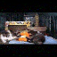
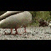

# Custom-Simple-Video-Diffusion

This is an attempt at implementing a Diffusion model for video generation by modifying a 2D U-Net to a 3D U-Net with additional changes to be able to support input of multiple sequential frames from a video and generate temporally coherent frames that when combined can be able to be saved as a gif or video and be played.

## How it works
This project utilises two models for generating a GIF of K frames:

1. Base model.

This utilises a Diffusion model to generate X frames. We load N sequental frames from a video dataset and starting from the initial frame we skip M frames in-between to obtain X frames which is then degraded by adding noise and then predicting the noise added to it.


2. Interpolation model.

This utilises a Cold-Diffusion model which reconstructs the image including an in-between frames from the generated X frames in the Base model to increase the frames to K frames. 


## Requirements
+ Python 3
+ [Optional] [Cuda-enabled GPU](https://developer.nvidia.com/cuda-gpus) or equivalent supported hardware.

## Set-Up
1. Install [virtualenvwrapper](https://virtualenvwrapper.readthedocs.io/en/latest/install.html).
2. Create a virtual enviroment:
```
mkvirtualenv video_diffusion_env
```
3. To activate virtualenv:
```
workon video_diffusion_env
```
4. To install the libraries needed by the project (Pytorch + Others) run the following script (This installs the CPU-only Pytorch libraries, which is lighter and runs on most machine):
```
sudo chmod +x install_cpu_requirements.sh
sh install_cpu_requirements.sh
```
[Optional] (Ignore Step 4) If you want to run and/or train using this project with the benefit of speed (hardware acceleration), you will require to install the appropriate [Pytorch](https://pytorch.org/) library and it's dependencies specific to you machine then you can install the additional python libraries needed by the project:
```
pip install -r requirements.txt
```

**NOTE**: The code was tested and run on Ubuntu 22.04.3 LTS, which was running on a CUDA-enabled GPU with additional libraries not shown above.

## Training Models
1. Create a training config file by executing the following command and follow the prompts:
+ For Base Video Diffusion (DDPM / DDIM) and Base Interpolation Diffusion (Cold Diffusion) Models:
```
python create_video_diffusion_config.py
```

2. To train a model, use the config files created above and run the folowing commands:
+ For Base Video Diffusion (DDPM / DDIM) models:
```
python train_base_video_diffusion.py --config-path "<File path to training config file>" --device <Device model will use>
```

+ For Base Video Interpolation (Cold Diffusion) models:
```
python train_base_interpolation.py --config-path "<File path to training config file>" --device <Device model will use>
```

## Generating Frames
Requires there to be a GenerateVideo json config file, example of format and data can be found in **JSON_Example** folder.

Run the following to generate frames as GIFs:
```
python generate_video.py -c "<Config path>" --device <Device model will run on> --out-dir <Output directory> --seed <Optional seed value>
```

## Extracting frames from a video
To generate a dataset from any video run the following:
```
python extract_video_frames.py --video-path <File path to video to extract frames from> --dest-path <Output path for extracted frames> --resize-dim <Dimensions for frames> --max-file-count <Number of frames to be stored in a folder>
```

## Examples of generated videos.
### DashCam Video
Dataset Source: https://youtu.be/qyN5aLRnZ-E


### Kitten Video
Dataset Source: https://www.youtube.com/watch?v=ftgcwsBqS0U



### Squirrel and Birds Video
Dataset Source: https://www.youtube.com/watch?v=C2EvpdSxOQg


