# Custom-Simple-Video-Diffusion

This is an attempt at implementing a Diffusion model for video generation by modifying a 2D U-Net to become a 3D U-Net with additional changes to allow the model to generate temporally coherent frames that when combined can become a GIF or video. Simple class labels can be used to control the output of the model.

This implementation is not based on any one single paper but uses multiple concepts from multiple sources.

## How it works
This project utilises two models for generating a GIF of K frames:

1. Base model.

This utilises a 3D Diffusion model to generate X frames. We load N sequental frames from a video dataset and starting from the initial frame we skip M frames in-between to obtain X frames which is then degraded by adding noise and then predicting the noise added to it. Labels for each frame can be *OPTIONALLY* passed to guide the output of the model.


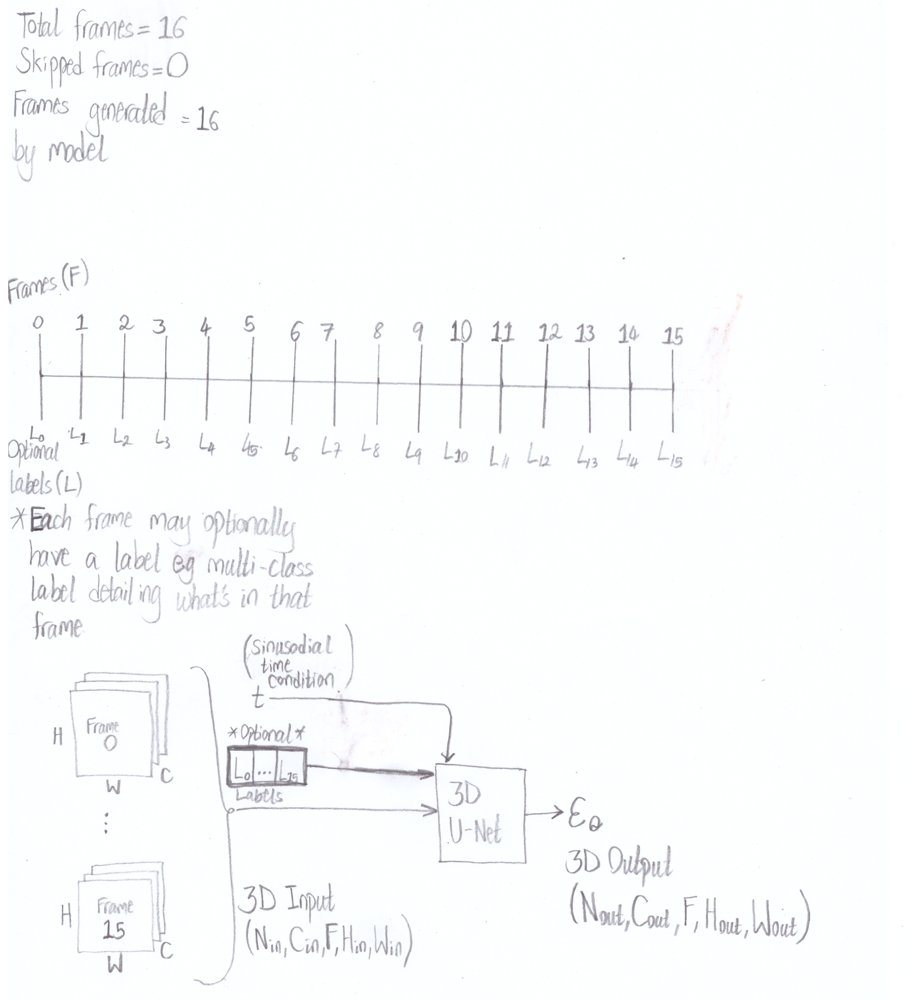

2. Upsampling model.

This utilises a 3D Diffusion model that contains a mapping layer and ADaIN layer similar to the implementation of [StyleGAN](https://arxiv.org/abs/1812.04948) to upsample low resolution images from Base models. This is a wierd custom implementation as it proved difficult to recreate other implementations of upsampling models and get decent results.

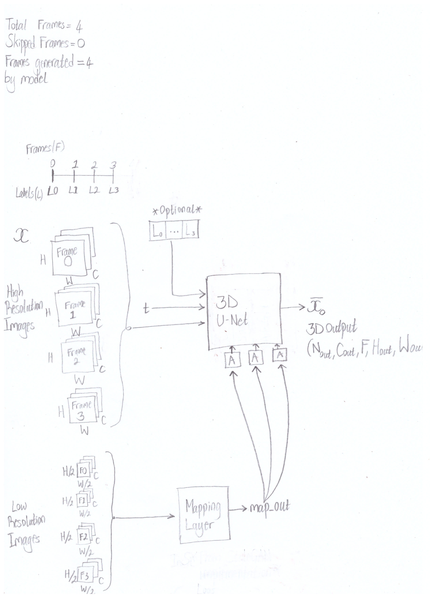

## Requirements
+ Python 3
+ [Optional] [Cuda-enabled GPU](https://developer.nvidia.com/cuda-gpus) or equivalent supported hardware.

## Set-Up
1. Install [virtualenvwrapper](https://virtualenvwrapper.readthedocs.io/en/latest/install.html).
2. Create a virtual enviroment:
```
mkvirtualenv video_diffusion_env
```
3. To activate virtualenv:
```
workon video_diffusion_env
```
4. To install the libraries needed by the project (Pytorch + Others) run the following script (This installs the CPU-only Pytorch libraries, which is lighter and runs on most machine):
```
sudo chmod +x install_cpu_requirements.sh
sh install_cpu_requirements.sh
```
[Optional] (Ignore Step 4) If you want to run and/or train using this project with the benefit of speed (hardware acceleration), you will require to install the appropriate [Pytorch](https://pytorch.org/) library and it's dependencies specific to you machine then you can install the additional python libraries needed by the project:
```
pip install -r requirements.txt
```

**NOTE**: The code was tested and run on Ubuntu 22.04.3 LTS, which was running on a CUDA-enabled GPU with additional libraries not shown above.

## Training Models
1. Create a training config file by executing the following command and follow the prompts and specify whether it will be for a base model or upsampling model in the proceeding prompts:
```
python create_video_diffusion_config.py
```

2. To train a model, use the config files created above and run the folowing commands:
```
python train_video_diffusion.py --config-path "<File path to training config file>" --device <Device model will use>
```

## Generating Frames
This requires there to be a json config file, an example of the format and data for it can be found in **JSON_Example** folder.

Run the following to generate frames as GIFs:
```
python generate_video.py -c "<Config path>" --device <Device model will run on, default: cpu> --out-dir <Output directory> --seed <Optional seed value> -n <Number of videos to generate, default: 1> --labels <Optional labels for each frame>
```

## Extracting frames from a video
To generate a dataset of frames from any video, run the following script:
```
python extract_video_frames.py --video-path <File path to video to extract frames from> --dest-path <Output path for extracted frames> --resize-dim <Dimensions for frames, will be padded to be a square dimension> --max-file-count <Max number of frames in each folder, a numbered folder is created when "filled up">
```

## Examples of generated videos.
Below are generated GIFs from some trained models (not shared), including source of the videos.

### DashCam Video
Dataset Source: https://youtu.be/qyN5aLRnZ-E

No labels were used in this model.

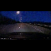

### Kitten Video
Dataset Source: https://www.youtube.com/watch?v=ftgcwsBqS0U

No labels were used in this model.

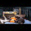

### Squirrel and Birds Video
Dataset Source: https://www.youtube.com/watch?v=C2EvpdSxOQg

No labels were used in this model.

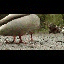

### Resident Evil 3: Nemesis Gameplay Video
Dataset Source: https://www.youtube.com/watch?v=d1XEqI_w8W4

More info: https://en.wikipedia.org/wiki/Resident_Evil_3:_Nemesis

To create labels for this dataset i used timestamps of the video, game locations character is in and other criteria such as when the game is paused and matched them to each individual frame. Below is a screenshot of some of the class labels used.

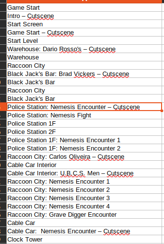

#### 32 * 32 GIF
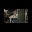

#### 64 * 64 GIF
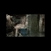

#### 128 * 128 GIF
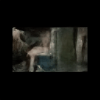

### Tekken 3 Gameplay Video

Dataset Source: https://www.youtube.com/watch?v=HoG9jmXMdW0

More info: https://en.wikipedia.org/wiki/Tekken_3

To create the labels for this dataset i used timestamps of the video, game characters on screen including the fights and each character's ending [cutscene](https://en.wikipedia.org/wiki/Cutscene) and matched them to their respective frame. Below is a screenshot of some of the class labels used.

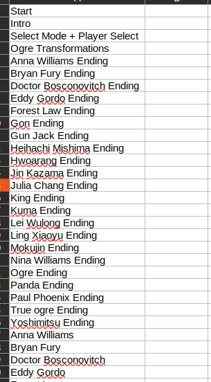

#### 32 * 32 GIF


#### 64 * 64 GIF
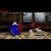

#### 128 * 128 GIF
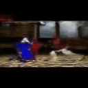

### Me in my room
This dataset was created by recording myself moving in my room with my phone for half an hour. I then used [YOLOv8](https://docs.ultralytics.com/) to obtain pose estimation keypoints which was used in the model as labels for their respective frames.

Here is an example of the keypoints for each frame used in generating the GIFS shown below.

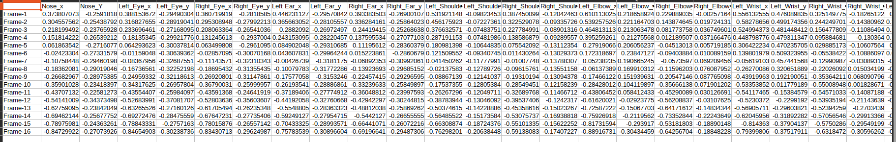

#### Visualization of keypoints
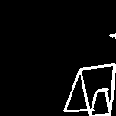

#### 32 * 32 GIF
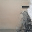

#### 64 * 64 GIF
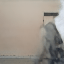

#### 128 * 128 GIF
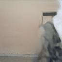
